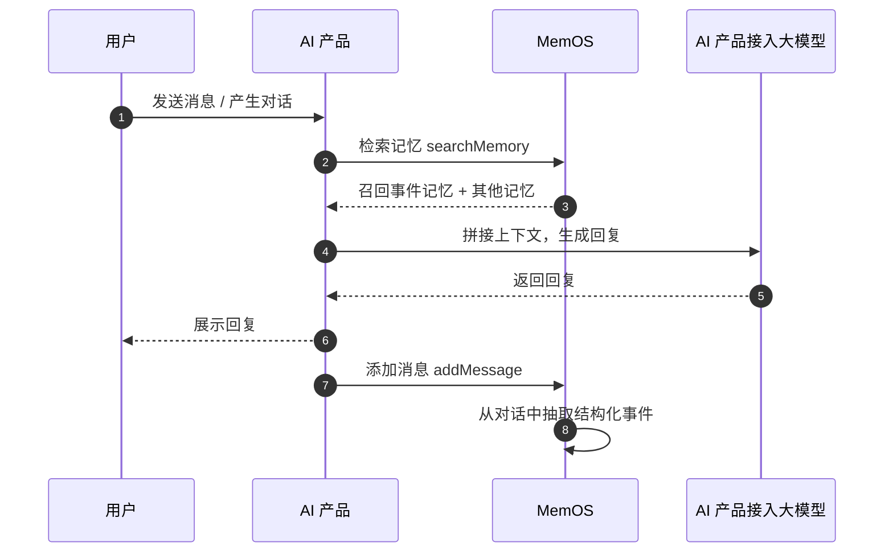

## 1. 事件记忆是什么？

事件记忆（Event）从对话中自动抽取结构化事件，保留时间、地点、参与者等关键要素，让 AI 能够准确、完整地回忆和引用过去的经历，使对话更有连续感。

:::note
适用场景

- 日程管理：记住"上周完成了哪个项目"、"下个月要参加的考试"；
- 客户服务历史：追溯客户的投诉、咨询、退换货等关键事件；
- 游戏 / 角色扮演中的剧情记忆：保留角色经历过的关键剧情节点。

事件记忆与[属性记忆](/cn/memos_cloud/features/profile)互补——属性记忆维护"TA 是谁"的稳定画像，事件记忆记录"TA 经历了什么"的动态过程。
:::

## 2. 关键参数

- **事件（event）**：从对话中抽取的一条结构化事件，是事件记忆的基本单元。
- **标题（title）**：事件的简短描述，如"和朋友去西湖露营"。
- **内容（content）**：事件的详细摘要，包含关键信息。
  - **事件时间**：事件发生的时间，优先使用消息中传入的 `chat_time`。
  - **参与者**：事件涉及的人物，从对话上下文中自动识别。
- **自定义抽取配置**：支持自定义事件记忆的抽取 Prompt，控制从对话中抽取事件的方式和关注维度。

## 3. 使用流程



上图展示了事件记忆的完整交互流程：

1. **检索使用**：用户对话时，检索召回与当前问题相关的事件记忆及其他[记忆种类](/cn/memos_cloud/introduction/memory_types)，拼接到大模型上下文中；
2. **生成回复**：大模型结合召回的事件记忆生成回复；
3. **自动抽取**：添加消息后，MemOS 自动从对话中抽取结构化事件并存储。

## 4. 使用示例

### 添加对话

添加消息时，在 `allow_memory_view` 中包含 `"event"` 即可触发事件记忆抽取。

::code-group

```python [Python (HTTP)]
import requests

API_KEY = "YOUR_API_KEY"
BASE_URL = "https://memos.memtensor.cn/api/openmem/v1"

data = {
    "user_id": "memos_user_123",
    "conversation_id": "conv_0624",
    "allow_memory_view": ["event", "detail_factual", "preference"],
    "messages": [
        {"role": "user", "content": "上周二下午和李四一起做了方案评审，客户对第二版方案比较满意，但希望把交付时间提前到七月底。"},
        {"role": "assistant", "content": "收到，需要我帮你整理一下评审中的关键结论吗？"}
    ]
}

res = requests.post(
    f"{BASE_URL}/add/message",
    headers={"Authorization": f"Token {API_KEY}"},
    json=data
)
print(res.json())
```

```python [Python (SDK)]
# 请确保已安装 MemOS（pip install MemoryOS -U）
from memos.api.client import MemOSClient

client = MemOSClient(api_key="YOUR_API_KEY")

res = client.add_message(
    user_id="memos_user_123",
    conversation_id="conv_0624",
    allow_memory_view=["event", "detail_factual", "preference"],
    messages=[
        {"role": "user", "content": "上周二下午和李四一起做了方案评审，客户对第二版方案比较满意，但希望把交付时间提前到七月底。"},
        {"role": "assistant", "content": "收到，需要我帮你整理一下评审中的关键结论吗？"}
    ]
)
print(res)
```

```bash [Curl]
curl --request POST \
  --url https://memos.memtensor.cn/api/openmem/v1/add/message \
  --header 'Authorization: Token YOUR_API_KEY' \
  --header 'Content-Type: application/json' \
  --data '{
    "user_id": "memos_user_123",
    "conversation_id": "conv_0624",
    "allow_memory_view": ["event", "detail_factual", "preference"],
    "messages": [
      {"role": "user", "content": "上周二下午和李四一起做了方案评审，客户对第二版方案比较满意，但希望把交付时间提前到七月底。"},
      {"role": "assistant", "content": "收到，需要我帮你整理一下评审中的关键结论吗？"}
    ]
  }'
```

::

### 检索事件记忆

调用 searchMemory 时，在 `include_memory_view` 中传入 `"event"` 即可召回事件记忆。

::code-group

```python [Python (HTTP)]
import requests

API_KEY = "YOUR_API_KEY"
BASE_URL = "https://memos.memtensor.cn/api/openmem/v1"

data = {
    "user_id": "memos_user_123",
    "query": "最近有什么评审或会议？",
    "include_memory_view": ["event"]
}

res = requests.post(
    f"{BASE_URL}/search/memory",
    headers={"Authorization": f"Token {API_KEY}"},
    json=data
)
print(res.json())
```

```python [Python (SDK)]
# 请确保已安装 MemOS（pip install MemoryOS -U）
from memos.api.client import MemOSClient

client = MemOSClient(api_key="YOUR_API_KEY")

res = client.search_memory(
    user_id="memos_user_123",
    query="最近有什么评审或会议？",
    include_memory_view=["event"]
)
print(res)
```

```bash [Curl]
curl --request POST \
  --url https://memos.memtensor.cn/api/openmem/v1/search/memory \
  --header 'Authorization: Token YOUR_API_KEY' \
  --header 'Content-Type: application/json' \
  --data '{
    "user_id": "memos_user_123",
    "query": "最近有什么评审或会议？",
    "include_memory_view": ["event"]
  }'
```

::

响应示例：

```json
{
  "code": 0,
  "message": "ok",
  "data": {
    "event_detail_list": [
      {
        "id": "d7785b39-1374-4738-b449-3e86ab1f8b2f",
        "event_key": "方案评审与交付调整",
        "event_value": "用户与李四于上周二下午完成方案评审，客户对第二版方案表示满意，并希望将交付时间提前至七月底。",
        "event_type": "EventMemory",
        "create_time": 1783929751765,
        "conversation_id": "conv_event_verify_001",
        "status": "activated",
        "update_time": 1783929757755,
        "relativity": 0.6364,
        "event_time": ["上周二下午", "七月底"],
        "event_location": [],
        "event_roles": ["用户", "李四", "客户"]
      }
    ]
  }
}
```

### 获取事件详情

通过 `get/memory/{memory_id}` 查询单条事件记忆。

::code-group

```python [Python (HTTP)]
import requests

API_KEY = "YOUR_API_KEY"
BASE_URL = "https://memos.memtensor.cn/api/openmem/v1"
memory_id = "d7785b39-1374-4738-b449-3e86ab1f8b2f"

res = requests.get(
    f"{BASE_URL}/get/memory/{memory_id}",
    headers={"Authorization": f"Token {API_KEY}"}
)
print(res.json())
```

```python [Python (SDK)]
# 请确保已安装 MemOS（pip install MemoryOS -U）
from memos.api.client import MemOSClient

client = MemOSClient(api_key="YOUR_API_KEY")

res = client.get_memory_by_id(memory_id="d7785b39-1374-4738-b449-3e86ab1f8b2f")
print(res)
```

```bash [Curl]
curl --request GET \
  --url https://memos.memtensor.cn/api/openmem/v1/get/memory/d7785b39-1374-4738-b449-3e86ab1f8b2f \
  --header 'Authorization: Token YOUR_API_KEY'
```

::

### 自定义抽取配置

事件记忆支持在控制台自定义抽取 Prompt，适用于需要调整抽取粒度或关注方向的场景：

1. 登录 [MemOS 控制台](https://memos-dashboard.openmem.net/cn/quickstart)，进入项目，找到「自定义抽取」；
2. 编辑事件记忆的抽取 Prompt，支持手动修改或 AI 辅助生成；
3. 使用「快速调试」验证抽取效果：输入样例对话，点击「运行抽取」，查看抽取的记忆是否符合预期；
4. 确认后保存修改。


## 5. 相关功能

<!-- markdownlint-disable MD003 MD022 MD023 -->
:::card-group
  :::card
  ---
  icon: i-ri-user-settings-line
  title: 属性记忆
  to: /cn/memos_cloud/features/profile
  ---
  维护用户或 AI 角色的结构化画像，与事件记忆互补
  :::

  :::card
  ---
  icon: i-ri-stack-line
  title: 记忆种类
  to: /cn/memos_cloud/introduction/memory_types
  ---
  了解事件记忆与其他记忆种类的区别
  :::
:::
<!-- markdownlint-enable MD003 MD022 MD023 -->
