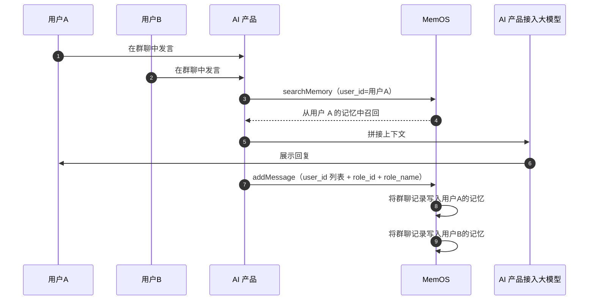

## 1. 群聊是什么？

群聊场景下，多个用户和/或 Agent 在同一会话中对话，MemOS 为每个参与者独立抽取和维护记忆。传入发言人的标识和名称后，记忆抽取会自动区分“谁说了什么”，生成以具体人名为主语的记忆，让每个参与者的画像更精准。

:::note
适用场景

- 项目群、周会、方案评审等多人同场讨论；
- 家庭 / 团队共用助手：一次群聊写入后，各成员记忆中都保留这份讨论；
- 多 Agent 参与：`agent_id` 同样支持数组，多个 AI 角色可一起参与。

:::

## 2. 关键参数

- **用户标识（user_id）**：支持字符串（单用户）或字符串数组（群聊多用户）。
- **Agent 标识（agent_id）**：同样支持字符串或字符串数组；多 Agent 可同时参与群聊。
- **发言人标识（role_id）**：群聊时建议传入，标识每条消息由谁发送，建议对应顶层 `user_id` / `agent_id` 中的某个值。
- **发言人名称（role_name）**：与 `role_id` 同时传入后，记忆文本中可带上人名，便于区分发言人。
- **会话标识（conversation_id）**：群聊会话的唯一标识。

### 限制说明

| 限制项 | 说明 |
| --- | --- |
| `user_id` / `agent_id` 列表上限 | 单次最多传入 20 个 ID |
| QPS 折算 | 按参与人数折算；例如传入 20 个 ID 时 ×20 折算，即每秒最多 2 次请求 |

更多通用配额说明见[配额与限制](/cn/memos_cloud/support/limit)。

## 3. 使用流程



1. **多人对话**：多个用户在同一会话中发言；
2. **按人检索**：用某个 `user_id` 调用 searchMemory，在该用户的记忆空间中检索；
3. **一次写入**：`user_id` 传为列表，每条消息标注 `role_id` / `role_name`；
4. **各自抽取**：列表中每位参与者都会抽取关于这份群聊的记忆。

## 4. 使用示例

### 添加群聊消息

例如张三、李四与助手在同一会话里对齐方案评审时间：

::code-group

```python [Python (HTTP)]
import requests

API_KEY = "YOUR_API_KEY"
BASE_URL = "https://memos.memtensor.cn/api/openmem/v1"

data = {
    "user_id": ["memos_user_1", "memos_user_2"],
    "agent_id": "memos_agent",
    "conversation_id": "group_conv_001",
    "messages": [
        {"role": "user", "role_id": "memos_user_1", "role_name": "张三", "content": "下周二的方案评审，大家时间合适吗？"},
        {"role": "user", "role_id": "memos_user_2", "role_name": "李四", "content": "我可以，下午两点怎么样？"},
        {"role": "assistant", "role_id": "memos_agent", "content": "已记录，下周二下午两点方案评审。需要我帮忙准备会议议程吗？"}
    ]
}

res = requests.post(
    f"{BASE_URL}/add/message",
    headers={"Authorization": f"Token {API_KEY}"},
    json=data
)
print(res.json())
```

```python [Python (SDK)]
# 请确保已安装 MemOS（pip install MemoryOS -U）
from memos.api.client import MemOSClient

client = MemOSClient(api_key="YOUR_API_KEY")

res = client.add_message(
    user_id=["memos_user_1", "memos_user_2"],
    agent_id="memos_agent",
    conversation_id="group_conv_001",
    messages=[
        {"role": "user", "role_id": "memos_user_1", "role_name": "张三", "content": "下周二的方案评审，大家时间合适吗？"},
        {"role": "user", "role_id": "memos_user_2", "role_name": "李四", "content": "我可以，下午两点怎么样？"},
        {"role": "assistant", "role_id": "memos_agent", "content": "已记录，下周二下午两点方案评审。需要我帮忙准备会议议程吗？"}
    ]
)
print(res)
```

```bash [Curl]
curl --request POST \
  --url https://memos.memtensor.cn/api/openmem/v1/add/message \
  --header 'Authorization: Token YOUR_API_KEY' \
  --header 'Content-Type: application/json' \
  --data '{
    "user_id": ["memos_user_1", "memos_user_2"],
    "agent_id": "memos_agent",
    "conversation_id": "group_conv_001",
    "messages": [
      {"role": "user", "role_id": "memos_user_1", "role_name": "张三", "content": "下周二的方案评审，大家时间合适吗？"},
      {"role": "user", "role_id": "memos_user_2", "role_name": "李四", "content": "我可以，下午两点怎么样？"},
      {"role": "assistant", "role_id": "memos_agent", "content": "已记录，下周二下午两点方案评审。需要我帮忙准备会议议程吗？"}
    ]
  }'
```

::

写入后，记忆文本里可通过 `role_name` 区分发言人。

### 检索群聊相关记忆

之后任一参与者继续对话时，用该用户的 `user_id` 检索即可召回这份群聊上下文。例如张三询问会议安排：

::code-group

```python [Python (HTTP)]
import requests

API_KEY = "YOUR_API_KEY"
BASE_URL = "https://memos.memtensor.cn/api/openmem/v1"

data = {
    "user_id": "memos_user_1",
    "query": "最近有什么会议安排？"
}

res = requests.post(
    f"{BASE_URL}/search/memory",
    headers={"Authorization": f"Token {API_KEY}"},
    json=data
)
print(res.json())
```

```python [Python (SDK)]
# 请确保已安装 MemOS（pip install MemoryOS -U）
from memos.api.client import MemOSClient

client = MemOSClient(api_key="YOUR_API_KEY")

res = client.search_memory(
    user_id="memos_user_1",
    query="最近有什么会议安排？"
)
print(res)
```

```bash [Curl]
curl --request POST \
  --url https://memos.memtensor.cn/api/openmem/v1/search/memory \
  --header 'Authorization: Token YOUR_API_KEY' \
  --header 'Content-Type: application/json' \
  --data '{
    "user_id": "memos_user_1",
    "query": "最近有什么会议安排？"
  }'
```

::

:::note
若仍需缩小检索范围，可在 `filter` 中使用 `related_id` 等条件。详见[记忆过滤](/cn/memos_cloud/features/filters)。
:::

## 5. 相关功能

<!-- markdownlint-disable MD003 MD022 MD023 -->
:::card-group
  :::card
  ---
  icon: i-ri-shield-user-line
  title: 多用户 / 多 Agent 隔离
  to: /cn/memos_cloud/introduction/isolation_filters
  ---
  了解 user_id、agent_id 与会话隔离机制
  :::

  :::card
  ---
  icon: i-ri-shield-line
  title: 配额与限制
  to: /cn/memos_cloud/support/limit
  ---
  群聊列表上限与 QPS 折算说明
  :::
:::
<!-- markdownlint-enable MD003 MD022 MD023 -->
