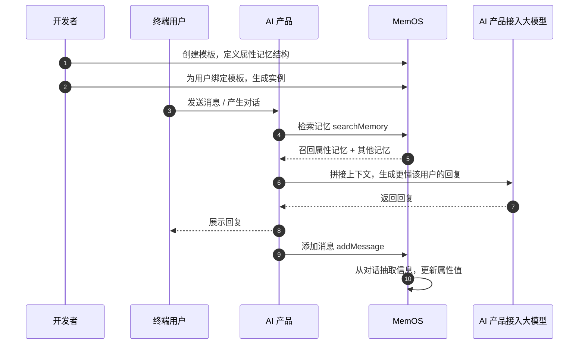

## 1. 属性记忆是什么？

AI 应用通常通过 Prompt 传入的固定角色设定，并根据提前设定的标签分类，对不同用户推送不同的回复内容实现“有记忆、个性化”。然而，随着对话的深入，用户会不断变化，人工维护的分类标签跟不上，用户的“专属感”也就无法凸显。

属性记忆（Profile）可用于构建结构化的画像，对话中的零散信息被抽取并映射到预先定义好的属性字段，并随对话深入自动更新、补全。核心特点包括：

- **结构化**：画像由预先定义的字段构成，统一存储、可直接取用，不分散在零散的记忆中；
- **持续更新**：随对话深入，MemOS 自动更新属性字段，让画像不断补全、始终贴合用户的最新状态，无需手写或手动维护；
- **字段级可控**：支持自定义每个字段是否允许自动更新，开放的字段随对话演进，关键字段可锁定，保持核心设定稳定、不随对话噪声偏移。

适用于 智能家居、品牌客服、金融投顾 等场景，用于增强对话一致性、稳定性，让 AI 长期记住用户是谁。

示例结构如下所示：

```plaintext
基础信息
  姓名：张三
  职业：工程师
  居住地：杭州
兴趣爱好
  爱好：露营、独立游戏
  喜欢的音乐：民谣
性格标签
  三个关键词：开朗、好奇、爱较真
```

:::note
可以同时绑定到 AI 角色（Agent）上，维护该角色的稳定人设。开启[为 Agent 创建独立记忆](/cn/memos_cloud/introduction/isolation_filters#为-agent-创建独立记忆-new)后，每个 Agent 拥有各自独立的属性记忆。

:::

## 2. 关键参数

- **模板（profile_template）**：用于定义属性记忆的字段结构，包括字段名称、层级、
  默认值、是否允许算法更新等。一个模板可以重复绑定到多个用户或 AI 角色。
- **实例（profile）**：用户或 AI 角色绑定模板后生成的属性记忆，用于存放各自的字段值。
- **属性**：实例中的具体字段项，如关系、兴趣、说话风格、纪念日等。
- **属性值（value）**：实例的字段值。添加消息时，MemOS 根据消息内容更新对应字段值。
- **算法更新标记（algorithm_updatable）**：用于控制字段是否允许被算法自动更新。
- **主体（user_id/agent_id）**：每个用户拥有各自独立的属性记忆实例；开启[为 Agent 创建独立记忆](/cn/memos_cloud/introduction/isolation_filters#为-agent-创建独立记忆-new)后，也可为 Agent（AI 角色）创建属性记忆实例。

## 3. 工作原理



上图展示了开发者、终端用户、AI 产品 与 MemOS 的完整交互流程：

1. **准备模板**：在控制台创建属性记忆模板，定义字段结构；
2. **绑定到主体**：为 用户/ AI 角色 绑定模板，生成属于 TA 的属性记忆实例；
3. **检索使用**：召回与当前问题相关的记忆，包含属性记忆，拼接到大模型上下文中，生成更懂用户的回复；
4. **自动更新**：后续添加消息时，MemOS 从对话中抽取信息，更新实例中对应的属性字段值。

:::note
当前，绑定模板**不会**自动回溯历史对话来填充属性值，建议从创建用户时就绑定模板。
:::

## 4. 使用示例

::note
有关 API 字段、格式等信息的完整列表，详见 [属性树操作](/api_docs/core/bind_profile_template)接口文档。
::

### 创建模板

属性记忆模板在 [MemOS 控制台](https://memos-dashboard.openmem.net) 中创建和维护。模板使用 JSON 描述，**最多三层**嵌套：

```json
{
  "基础信息": {
    "姓名": { "value": "", "algorithm_updatable": false },
    "职业": { "value": "", "algorithm_updatable": true },
    "居住地": { "value": "", "algorithm_updatable": true }
  },
  "性格标签": {
    "三个关键词": { "value": "", "algorithm_updatable": true }
  }
}
```

- `value`：属性字段值，可以留空或填入默认值；
- `algorithm_updatable`：标记该属性是否允许算法从对话中自动更新。

:::warning
修改或删除模板中的字段，会影响所有绑定过该模板的属性记忆实例字段，请谨慎修改已绑定示例的属性树模板。
:::

### 绑定用户到模板

为用户绑定模板后，MemOS 会为该用户创建属性记忆实例。后续添加消息时 MemOS 自动更新对应字段值，动态维护用户画像。

::code-group

```python [Python (HTTP)]
import requests

API_KEY = "YOUR_API_KEY"
BASE_URL = "https://memos.memtensor.cn/api/openmem/v1"

data = {
    "bind_list": [
        {"user_id": "memos_user_123", "profile_template_id": "tpl_user_001"}
    ]
}

res = requests.post(
    f"{BASE_URL}/bind/profile_template",
    headers={"Authorization": f"Token {API_KEY}"},
    json=data
)
print(res.json())
```

```python [Python (SDK)]
# 请确保已安装 MemOS (pip install MemoryOS -U)
from memos.api.client import MemOSClient

client = MemOSClient(api_key="YOUR_API_KEY")

res = client.bind_profile_template(
    bind_list=[{"user_id": "memos_user_123", "profile_template_id": "tpl_user_001"}]
)
print(res)
```

```bash [Curl]
curl --request POST \
  --url https://memos.memtensor.cn/api/openmem/v1/bind/profile_template \
  --header 'Authorization: Token YOUR_API_KEY' \
  --header 'Content-Type: application/json' \
  --data '{
    "bind_list": [
      {
        "user_id": "memos_user_123",
        "profile_template_id": "tpl_user_001"
      }
    ]
  }'
```

::

### 添加对话

用户在对话中提到自己的职业和爱好，MemOS 自动抽取信息并更新属性记忆。

::code-group

```python [Python (HTTP)]
import requests

API_KEY = "YOUR_API_KEY"
BASE_URL = "https://memos.memtensor.cn/api/openmem/v1"

data = {
    "user_id": "memos_user_123",
    "conversation_id": "conv_0624",
    "allow_memory_view": ["profile", "detail_factual", "preference"],
    "messages": [
        {"role": "user", "content": "我在杭州做产品经理，平时喜欢看科幻小说和露营。"},
        {"role": "assistant", "content": "了解了，杭州是个好地方，周边露营地很多。"}
    ]
}

res = requests.post(
    f"{BASE_URL}/add/message",
    headers={"Authorization": f"Token {API_KEY}"},
    json=data
)
print(res.json())
```

```python [Python (SDK)]
# 请确保已安装 MemOS (pip install MemoryOS -U)
from memos.api.client import MemOSClient

client = MemOSClient(api_key="YOUR_API_KEY")

res = client.add_message(
    user_id="memos_user_123",
    conversation_id="conv_0624",
    allow_memory_view=["profile", "detail_factual", "preference"],
    messages=[
        {"role": "user", "content": "我在杭州做产品经理，平时喜欢看科幻小说和露营。"},
        {"role": "assistant", "content": "了解了，杭州是个好地方，周边露营地很多。"}
    ]
)
print(res)
```

```bash [Curl]
curl --request POST \
  --url https://memos.memtensor.cn/api/openmem/v1/add/message \
  --header 'Authorization: Token YOUR_API_KEY' \
  --header 'Content-Type: application/json' \
  --data '{
    "user_id": "memos_user_123",
    "conversation_id": "conv_0624",
    "allow_memory_view": ["profile", "detail_factual", "preference"],
    "messages": [
      {"role": "user", "content": "我在杭州做产品经理，平时喜欢看科幻小说和露营。"},
      {"role": "assistant", "content": "了解了，杭州是个好地方，周边露营地很多。"}
    ]
  }'
```

::

### 检索属性记忆

在新会话中询问用户信息时，调用检索记忆接口，在 `include_memory_view` 中传入 `"profile"` 即可召回属性记忆。

::code-group

```python [Python (HTTP)]
import requests

API_KEY = "YOUR_API_KEY"
BASE_URL = "https://memos.memtensor.cn/api/openmem/v1"

data = {
    "user_id": "memos_user_123",
    "query": "这个用户的基本情况是什么？",
    "include_memory_view": ["profile"]
}

res = requests.post(
    f"{BASE_URL}/search/memory",
    headers={"Authorization": f"Token {API_KEY}"},
    json=data
)
print(res.json())
```

```python [Python (SDK)]
# 请确保已安装 MemOS (pip install MemoryOS -U)
from memos.api.client import MemOSClient

client = MemOSClient(api_key="YOUR_API_KEY")

res = client.search_memory(
    user_id="memos_user_123",
    query="这个用户的基本情况是什么？",
    include_memory_view=["profile"]
)
print(res)
```

```bash [Curl]
curl --request POST \
  --url https://memos.memtensor.cn/api/openmem/v1/search/memory \
  --header 'Authorization: Token YOUR_API_KEY' \
  --header 'Content-Type: application/json' \
  --data '{
    "user_id": "memos_user_123",
    "query": "这个用户的基本情况是什么？",
    "include_memory_view": ["profile"]
  }'
```

::

响应示例：

```json
{
  "code": 0,
  "message": "ok",
  "data": {
    "profile_detail_list": [
      {
        "id": "memos97701df652bb42cf8fe276b0da1441f3_tpl_bb0948b22fe7_e6a0dbfb3d47",
        "memory": "基础信息.职业: 产品经理",
        "memory_type": "ProfileMemory",
        "template_id": "tpl_bb0948b22fe7",
        "profile_category": "基础信息",
        "profile_field": "职业",
        "profile_path": "基础信息.职业",
        "status": "activated",
        "confidence": 0.99,
        "relativity": 0.6782,
        "algorithm_updatable": true
      },
      {
        "id": "memos97701df652bb42cf8fe276b0da1441f3_tpl_bb0948b22fe7_2785203c3b81",
        "memory": "基础信息.居住地: 杭州",
        "memory_type": "ProfileMemory",
        "template_id": "tpl_bb0948b22fe7",
        "profile_category": "基础信息",
        "profile_field": "居住地",
        "profile_path": "基础信息.居住地",
        "status": "activated",
        "confidence": 0.99,
        "relativity": 0.6808,
        "algorithm_updatable": true
      }
    ]
  }
}
```

### 编辑属性值

用户搬家到了上海，手动更新“居住地”并锁定该字段，防止后续对话中被自动覆盖。

::code-group

```python [Python (HTTP)]
import requests

API_KEY = "YOUR_API_KEY"
BASE_URL = "https://memos.memtensor.cn/api/openmem/v1"

data = {
    "user_id": "memos_user_123",
    "profile_template_id": "tpl_user_001",
    "metadata": {
        "基础信息": {
            "居住地": {
                "value": "上海",
                "algorithm_updatable": False
            }
        }
    }
}

res = requests.post(
    f"{BASE_URL}/edit/profile",
    headers={"Authorization": f"Token {API_KEY}"},
    json=data
)
print(res.json())
```

```python [Python (SDK)]
# 请确保已安装 MemOS (pip install MemoryOS -U)
from memos.api.client import MemOSClient

client = MemOSClient(api_key="YOUR_API_KEY")

res = client.edit_profile(
    user_id="memos_user_123",
    profile_template_id="tpl_user_001",
    metadata={
        "基础信息": {
            "居住地": {
                "value": "上海",
                "algorithm_updatable": False
            }
        }
    }
)
print(res)
```

```bash [Curl]
curl --request POST \
  --url https://memos.memtensor.cn/api/openmem/v1/edit/profile \
  --header 'Authorization: Token YOUR_API_KEY' \
  --header 'Content-Type: application/json' \
  --data '{
    "user_id": "memos_user_123",
    "profile_template_id": "tpl_user_001",
    "metadata": {
      "基础信息": {
        "居住地": {
          "value": "上海",
          "algorithm_updatable": false
        }
      }
    }
  }'
```

::

### 删除实例

不再需要某个用户的属性记忆时，可删除实例，绑定关系和所有字段值一并清除。

::code-group

```python [Python (HTTP)]
import requests

API_KEY = "YOUR_API_KEY"
BASE_URL = "https://memos.memtensor.cn/api/openmem/v1"

data = {
    "user_id": "memos_user_123",
    "profile_template_id": "tpl_user_001"
}

res = requests.post(
    f"{BASE_URL}/delete/profile",
    headers={"Authorization": f"Token {API_KEY}"},
    json=data
)
print(res.json())
```

```python [Python (SDK)]
# 请确保已安装 MemOS (pip install MemoryOS -U)
from memos.api.client import MemOSClient

client = MemOSClient(api_key="YOUR_API_KEY")

res = client.delete_profile(
    user_id="memos_user_123",
    profile_template_id="tpl_user_001"
)
print(res)
```

```bash [Curl]
curl --request POST \
  --url https://memos.memtensor.cn/api/openmem/v1/delete/profile \
  --header 'Authorization: Token YOUR_API_KEY' \
  --header 'Content-Type: application/json' \
  --data '{
    "user_id": "memos_user_123",
    "profile_template_id": "tpl_user_001"
  }'
```

::

## 5. 相关功能

<!-- markdownlint-disable MD003 MD022 MD023 -->
:::card-group
  :::card
  ---
  icon: i-ri-stack-line
  title: 记忆种类
  to: /cn/memos_cloud/introduction/memory_types
  ---
  了解属性记忆与其他记忆种类的区别
  :::

  :::card
  ---
  icon: i-ri-calendar-event-line
  title: 事件记忆
  to: /cn/memos_cloud/features/event_memory
  ---
  从对话中抽取带时间、地点、参与者的结构化事件
  :::

:::
<!-- markdownlint-enable MD003 MD022 MD023 -->
