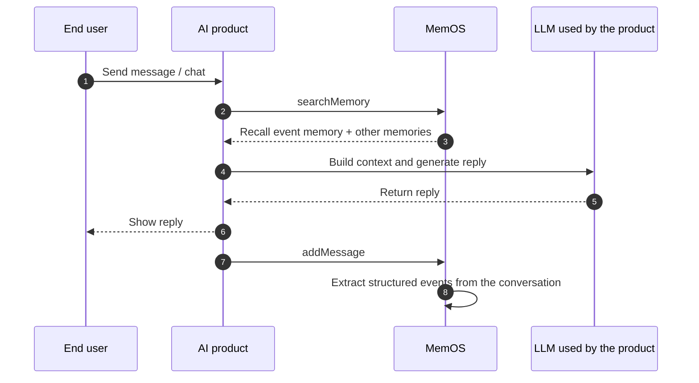

## 1. What is Event Memory?

Event Memory extracts structured events from conversations and keeps key elements such as time, location, and participants, so the AI can accurately recall and reference past experiences with better continuity.

:::note
Typical scenarios

- Schedule tracking: remember which project was finished last week, or which exam is coming next month;
- Customer service history: trace complaints, inquiries, returns, and other key events;
- Game / role-play story memory: keep critical plot nodes the character has experienced.

Event Memory complements Profile — Profile maintains a stable picture of who someone is, while Event Memory records what they went through.
:::

## 2. Key Concepts

- **Event（event）**: A structured event extracted from conversation; the basic unit of Event Memory.
- **Title（title）**: A short description of the event, such as "camping by West Lake with friends".
- **Content（content）**: A detailed summary of the event, including key information.
  - **Event time**: When the event happened; prefers `chat_time` from the message when available.
  - **Participants**: People involved in the event, identified from conversation context.
- **Custom extraction config**: Supports a custom Event Memory extraction prompt to control how events are extracted and what to focus on.

## 3. Workflow



Flow summary:

1. **Retrieve**: During chat, recall relevant Event Memory and other [memory categories](/memos_cloud/introduction/memory_types), then inject them into the LLM context;
2. **Generate**: The LLM generates a reply with the recalled events;
3. **Extract**: After messages are added, MemOS automatically extracts structured events and stores them.

## 4. Examples

### Add messages

Include `"event"` in `allow_memory_view` when adding messages to trigger Event Memory extraction.

::code-group

```python [Python (HTTP)]
import requests

API_KEY = "YOUR_API_KEY"
BASE_URL = "https://memos.memtensor.cn/api/openmem/v1"

data = {
    "user_id": "memos_user_123",
    "conversation_id": "conv_0624",
    "allow_memory_view": ["event", "detail_factual", "preference"],
    "messages": [
        {"role": "user", "content": "Last Tuesday afternoon I did a proposal review with Li Si. The customer liked the second version and wants delivery moved up to the end of July."},
        {"role": "assistant", "content": "Got it. Want me to summarize the key conclusions from the review?"}
    ]
}

res = requests.post(
    f"{BASE_URL}/add/message",
    headers={"Authorization": f"Token {API_KEY}"},
    json=data
)
print(res.json())
```

```python [Python (SDK)]
# Make sure MemOS is installed (pip install MemoryOS -U)
from memos.api.client import MemOSClient

client = MemOSClient(api_key="YOUR_API_KEY")

res = client.add_message(
    user_id="memos_user_123",
    conversation_id="conv_0624",
    allow_memory_view=["event", "detail_factual", "preference"],
    messages=[
        {"role": "user", "content": "Last Tuesday afternoon I did a proposal review with Li Si. The customer liked the second version and wants delivery moved up to the end of July."},
        {"role": "assistant", "content": "Got it. Want me to summarize the key conclusions from the review?"}
    ]
)
print(res)
```

```bash [Curl]
curl --request POST \
  --url https://memos.memtensor.cn/api/openmem/v1/add/message \
  --header 'Authorization: Token YOUR_API_KEY' \
  --header 'Content-Type: application/json' \
  --data '{
    "user_id": "memos_user_123",
    "conversation_id": "conv_0624",
    "allow_memory_view": ["event", "detail_factual", "preference"],
    "messages": [
      {"role": "user", "content": "Last Tuesday afternoon I did a proposal review with Li Si. The customer liked the second version and wants delivery moved up to the end of July."},
      {"role": "assistant", "content": "Got it. Want me to summarize the key conclusions from the review?"}
    ]
  }'
```

::

### Search Event Memory

When calling searchMemory, related events are returned in `event_detail_list`.

::code-group

```python [Python (HTTP)]
import requests

API_KEY = "YOUR_API_KEY"
BASE_URL = "https://memos.memtensor.cn/api/openmem/v1"

data = {
    "user_id": "memos_user_123",
    "query": "Any recent reviews or meetings?",
    "include_memory_view": ["event"]
}

res = requests.post(
    f"{BASE_URL}/search/memory",
    headers={"Authorization": f"Token {API_KEY}"},
    json=data
)
print(res.json())
```

```python [Python (SDK)]
# Make sure MemOS is installed (pip install MemoryOS -U)
from memos.api.client import MemOSClient

client = MemOSClient(api_key="YOUR_API_KEY")

res = client.search_memory(
    user_id="memos_user_123",
    query="Any recent reviews or meetings?",
    include_memory_view=["event"]
)
print(res)
```

```bash [Curl]
curl --request POST \
  --url https://memos.memtensor.cn/api/openmem/v1/search/memory \
  --header 'Authorization: Token YOUR_API_KEY' \
  --header 'Content-Type: application/json' \
  --data '{
    "user_id": "memos_user_123",
    "query": "Any recent reviews or meetings?",
    "include_memory_view": ["event"]
  }'
```

::

Example response:

```json
{
  "code": 0,
  "message": "ok",
  "data": {
    "event_detail_list": [
      {
        "id": "d7785b39-1374-4738-b449-3e86ab1f8b2f",
        "event_key": "方案评审与交付调整",
        "event_value": "用户与李四于上周二下午完成方案评审，客户对第二版方案表示满意，并希望将交付时间提前至七月底。",
        "event_type": "EventMemory",
        "create_time": 1783929751765,
        "conversation_id": "conv_event_verify_001",
        "status": "activated",
        "update_time": 1783929757755,
        "relativity": 0.6364,
        "event_time": ["上周二下午", "七月底"],
        "event_location": [],
        "event_roles": ["用户", "李四", "客户"]
      }
    ]
  }
}
```

### Get event details

Use `get/memory/{memory_id}` to fetch a single Event Memory.

::code-group

```python [Python (HTTP)]
import requests

API_KEY = "YOUR_API_KEY"
BASE_URL = "https://memos.memtensor.cn/api/openmem/v1"
memory_id = "d7785b39-1374-4738-b449-3e86ab1f8b2f"

res = requests.get(
    f"{BASE_URL}/get/memory/{memory_id}",
    headers={"Authorization": f"Token {API_KEY}"}
)
print(res.json())
```

```python [Python (SDK)]
# Make sure MemOS is installed (pip install MemoryOS -U)
from memos.api.client import MemOSClient

client = MemOSClient(api_key="YOUR_API_KEY")

res = client.get_memory_by_id(memory_id="d7785b39-1374-4738-b449-3e86ab1f8b2f")
print(res)
```

```bash [Curl]
curl --request GET \
  --url https://memos.memtensor.cn/api/openmem/v1/get/memory/d7785b39-1374-4738-b449-3e86ab1f8b2f \
  --header 'Authorization: Token YOUR_API_KEY'
```

::

Unlike Profile Memory, Event Memory can be retrieved with `GET /get/memory/{id}`.

### Custom extraction config

Event Memory supports a custom extraction prompt in the dashboard when you need finer control over extraction granularity or focus:

1. Sign in to the [MemOS Dashboard](https://memos-dashboard.openmem.net/quickstart), open your project, and go to **Custom Extraction**;
2. Edit the Event Memory prompt — manually or with AI assistance;
3. Use **Quick Debug** to validate: enter sample dialogue, click **Run Extraction**, and check whether the extracted events look right;
4. Save when ready.


## 5. Related features

<!-- markdownlint-disable MD003 MD022 MD023 -->
:::card-group
  :::card
  ---
  icon: i-ri-user-settings-line
  title: Profile
  to: /memos_cloud/features/profile
  ---
  Maintain a structured profile for a user or AI Agent; complements Event Memory
  :::

  :::card
  ---
  icon: i-ri-stack-line
  title: Memory Categories
  to: /memos_cloud/introduction/memory_types
  ---
  How Event Memory differs from other memory types
  :::
:::
<!-- markdownlint-enable MD003 MD022 MD023 -->

