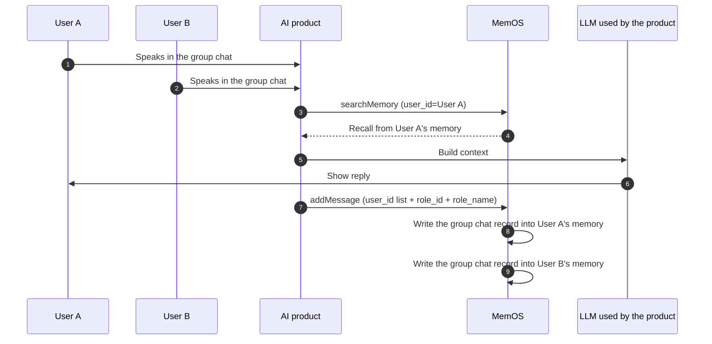

## 1. What is Group Chat?

In group chat scenarios, multiple users and/or Agents converse in the same session, and MemOS extracts and maintains memory for each participant. Once you pass in each speaker's identifier and name, memory extraction distinguishes "who said what" and produces memories with the specific person's name as the subject — so each participant is remembered more accurately.

:::note
Typical scenarios

- Multi-person discussions such as project groups, weekly meetings, and proposal reviews;
- Shared family / team assistants: after one group-chat write, each member's memory keeps a record of that discussion;
- Multi-Agent participation: `agent_id` also accepts an array, so multiple AI roles can join the same session.

:::

## 2. Key Concepts

- **User ID (`user_id`)**: accepts a string (single user) or an array of strings (multiple users in a group chat).
- **Agent ID (`agent_id`)**: also accepts a string or an array of strings; multiple Agents can participate in the same group chat.
- **Speaker ID (`role_id`)**: recommended in group chats; identifies who sent each message, matching one of the values in the top-level `user_id` / `agent_id`.
- **Speaker name (`role_name`)**: when passed together with `role_id`, memory text can include the person's name so speakers are easier to tell apart.
- **Conversation ID (`conversation_id`)**: the unique identifier for the group chat session.

### Limits

| Limit | Description |
| --- | --- |
| `user_id` / `agent_id` list size | Up to 20 IDs per request |
| QPS conversion | Scaled by the number of participants; for example, passing 20 IDs applies a ×20 factor, i.e. at most 2 requests per second |

For more general quota details, see [Quotas and Limits](/memos_cloud/support/limit).

## 3. Workflow



1. **Multi-person conversation**: multiple users speak in the same session;
2. **Retrieve per person**: call searchMemory with a given `user_id` to search that user's memory space;
3. **Write once**: pass `user_id` as a list, and tag each message with `role_id` / `role_name`;
4. **Extract for each participant**: each participant in the list gets memory extracted about this group chat.

## 4. Examples

### Add a group chat message

For example, Alex and Jordan align on a proposal-review time with an assistant in the same session:

::code-group

```python [Python (HTTP)]
import requests

API_KEY = "YOUR_API_KEY"
BASE_URL = "https://memos.memtensor.cn/api/openmem/v1"

data = {
    "user_id": ["memos_user_1", "memos_user_2"],
    "agent_id": "memos_agent",
    "conversation_id": "group_conv_001",
    "messages": [
        {"role": "user", "role_id": "memos_user_1", "role_name": "Alex", "content": "Does next Tuesday work for everyone for the proposal review?"},
        {"role": "user", "role_id": "memos_user_2", "role_name": "Jordan", "content": "Works for me. How about 2pm?"},
        {"role": "assistant", "role_id": "memos_agent", "content": "Got it. Proposal review next Tuesday at 2pm. Want me to help prepare the agenda?"}
    ]
}

res = requests.post(
    f"{BASE_URL}/add/message",
    headers={"Authorization": f"Token {API_KEY}"},
    json=data
)
print(res.json())
```

```python [Python (SDK)]
# Make sure MemOS is installed (pip install MemoryOS -U)
from memos.api.client import MemOSClient

client = MemOSClient(api_key="YOUR_API_KEY")

res = client.add_message(
    user_id=["memos_user_1", "memos_user_2"],
    agent_id="memos_agent",
    conversation_id="group_conv_001",
    messages=[
        {"role": "user", "role_id": "memos_user_1", "role_name": "Alex", "content": "Does next Tuesday work for everyone for the proposal review?"},
        {"role": "user", "role_id": "memos_user_2", "role_name": "Jordan", "content": "Works for me. How about 2pm?"},
        {"role": "assistant", "role_id": "memos_agent", "content": "Got it. Proposal review next Tuesday at 2pm. Want me to help prepare the agenda?"}
    ]
)
print(res)
```

```bash [Curl]
curl --request POST \
  --url https://memos.memtensor.cn/api/openmem/v1/add/message \
  --header 'Authorization: Token YOUR_API_KEY' \
  --header 'Content-Type: application/json' \
  --data '{
    "user_id": ["memos_user_1", "memos_user_2"],
    "agent_id": "memos_agent",
    "conversation_id": "group_conv_001",
    "messages": [
      {"role": "user", "role_id": "memos_user_1", "role_name": "Alex", "content": "Does next Tuesday work for everyone for the proposal review?"},
      {"role": "user", "role_id": "memos_user_2", "role_name": "Jordan", "content": "Works for me. How about 2pm?"},
      {"role": "assistant", "role_id": "memos_agent", "content": "Got it. Proposal review next Tuesday at 2pm. Want me to help prepare the agenda?"}
    ]
  }'
```

::

After writing, speakers can be told apart in memory text via `role_name`.

### Search group-chat related memories

When any participant continues the conversation later, search with that user's `user_id` to recall this group-chat context. For example, Alex asks about meeting plans:

::code-group

```python [Python (HTTP)]
import requests

API_KEY = "YOUR_API_KEY"
BASE_URL = "https://memos.memtensor.cn/api/openmem/v1"

data = {
    "user_id": "memos_user_1",
    "query": "What meetings do I have coming up?"
}

res = requests.post(
    f"{BASE_URL}/search/memory",
    headers={"Authorization": f"Token {API_KEY}"},
    json=data
)
print(res.json())
```

```python [Python (SDK)]
# Make sure MemOS is installed (pip install MemoryOS -U)
from memos.api.client import MemOSClient

client = MemOSClient(api_key="YOUR_API_KEY")

res = client.search_memory(
    user_id="memos_user_1",
    query="What meetings do I have coming up?"
)
print(res)
```

```bash [Curl]
curl --request POST \
  --url https://memos.memtensor.cn/api/openmem/v1/search/memory \
  --header 'Authorization: Token YOUR_API_KEY' \
  --header 'Content-Type: application/json' \
  --data '{
    "user_id": "memos_user_1",
    "query": "What meetings do I have coming up?"
  }'
```

::

:::note
If you still need to narrow the search further, use conditions such as `related_id` in `filter`. See [Memory Filters](/memos_cloud/features/filters).
:::

## 5. Related Features

<!-- markdownlint-disable MD003 MD022 MD023 -->
:::card-group
  :::card
  ---
  icon: i-ri-shield-user-line
  title: Multi-user / Multi-Agent Isolation
  to: /memos_cloud/introduction/isolation_filters
  ---
  How user_id, agent_id, and conversation isolation work
  :::

  :::card
  ---
  icon: i-ri-shield-line
  title: Quotas and Limits
  to: /memos_cloud/support/limit
  ---
  Group chat list limits and QPS conversion details
  :::
:::
<!-- markdownlint-enable MD003 MD022 MD023 -->
