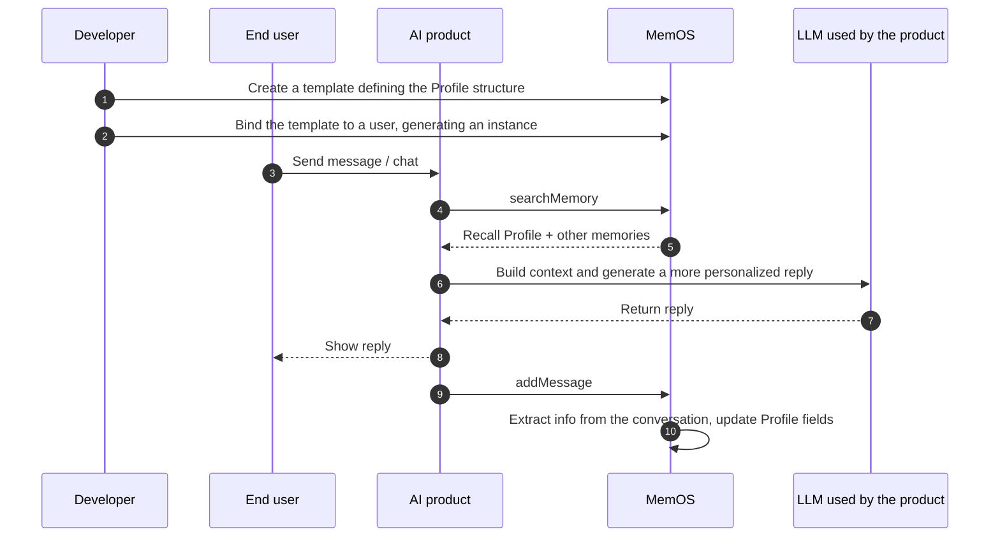

## 1. What is Profile?

AI applications often try to achieve a sense of "memory and personalization" through a fixed persona passed in the prompt, combined with predefined tags that route different users to different canned replies. But as conversations continue, users keep changing — manually maintained tags can't keep up, and the feeling of being personally known never really lands.

Profile lets you build a structured picture of a user or AI Agent. Scattered pieces of information from conversations are extracted and mapped onto predefined fields, then automatically updated and completed as the conversation deepens. Key characteristics include:

- **Structured**: the profile is made up of predefined fields, stored together and directly usable, instead of being scattered across individual memories;
- **Continuously updated**: as conversations continue, MemOS automatically updates the fields so the profile keeps catching up with the user's latest state — no manual maintenance required;
- **Field-level control**: you can configure whether each field can be updated automatically. Open fields evolve with the conversation, while key fields can be locked to stay stable and avoid drifting with conversational noise.

Profile fits scenarios such as smart home, brand customer service, and financial advisory — anywhere that benefits from consistent, stable conversations where the AI remembers who the user is over the long term.

An example structure:

```plaintext
Basic Info
  Name: Alex
  Occupation: Engineer
  Location: Hangzhou
Interests
  Hobbies: camping, indie games
  Favorite music: folk
Personality Tags
  Three keywords: outgoing, curious, meticulous
```

:::note
Profile can also be bound to an AI Agent to maintain a stable persona for that Agent. After enabling [Create Independent Memory for an Agent](/memos_cloud/introduction/isolation_filters#create-independent-memory-for-an-agent), each Agent gets its own Profile.

:::

## 2. Key Concepts

- **Template (`profile_template`)**: defines the field structure of a Profile, including field names, hierarchy, default values, and whether algorithmic updates are allowed. A single template can be bound to multiple users or Agents.
- **Instance (`profile`)**: the Profile created when a user or Agent is bound to a template; it stores that user's or Agent's own field values.
- **Attribute**: a specific field in an instance, such as relationship, interests, communication style, or anniversaries.
- **Value (`value`)**: the value of a field in an instance. When messages are added, MemOS updates the corresponding field value based on the message content.
- **Algorithm-updatable flag (`algorithm_updatable`)**: controls whether a field can be automatically updated by the algorithm.
- **Subject (`user_id`/`agent_id`)**: each user has their own Profile instance. After enabling [Create Independent Memory for an Agent](/memos_cloud/introduction/isolation_filters#create-independent-memory-for-an-agent), you can also create Profile instances for Agents.

## 3. How It Works



The diagram above shows the full interaction flow between the developer, end user, AI product, and MemOS:

1. **Prepare a template**: create a Profile template in the dashboard and define the field structure;
2. **Bind to a subject**: bind the template to a user or Agent to create their own Profile instance;
3. **Retrieve and use**: recall memories relevant to the current question, including the Profile, and add them to the LLM context to generate a reply that better understands the user;
4. **Auto-update**: as more messages are added, MemOS extracts information from the conversation and updates the corresponding fields in the instance.

:::note
Binding a template currently does **not** retroactively fill in field values from past conversations. We recommend binding the template as soon as the user is created.
:::

## 4. Examples

::note
For the complete list of API fields, formats, and other details, see the [Bind Profile Template](/api_docs/core/bind_profile_template) API documentation.
::

### Create a template

Profile templates are created and maintained in the [MemOS Dashboard](https://memos-dashboard.openmem.net). Templates are described in JSON, with **up to three levels** of nesting:

```json
{
  "Basic Info": {
    "Name": { "value": "", "algorithm_updatable": false },
    "Occupation": { "value": "", "algorithm_updatable": true },
    "Location": { "value": "", "algorithm_updatable": true }
  },
  "Personality Tags": {
    "Three keywords": { "value": "", "algorithm_updatable": true }
  }
}
```

- `value`: the field's value; leave it empty or provide a default;
- `algorithm_updatable`: marks whether the field can be automatically updated by the algorithm from conversations.

:::warning
Editing or deleting a field in a template affects that field across every Profile instance already bound to the template. Be careful when modifying a template that has bound instances.
:::

### Bind a user to a template

After you bind a template to a user, MemOS creates a Profile instance for that user. As messages are added, MemOS automatically updates the corresponding field values, keeping the profile up to date.

::code-group

```python [Python (HTTP)]
import requests

API_KEY = "YOUR_API_KEY"
BASE_URL = "https://memos.memtensor.cn/api/openmem/v1"

data = {
    "bind_list": [
        {"user_id": "memos_user_123", "profile_template_id": "tpl_user_001"}
    ]
}

res = requests.post(
    f"{BASE_URL}/bind/profile_template",
    headers={"Authorization": f"Token {API_KEY}"},
    json=data
)
print(res.json())
```

```python [Python (SDK)]
# Make sure MemOS is installed (pip install MemoryOS -U)
from memos.api.client import MemOSClient

client = MemOSClient(api_key="YOUR_API_KEY")

res = client.bind_profile_template(
    bind_list=[{"user_id": "memos_user_123", "profile_template_id": "tpl_user_001"}]
)
print(res)
```

```bash [Curl]
curl --request POST \
  --url https://memos.memtensor.cn/api/openmem/v1/bind/profile_template \
  --header 'Authorization: Token YOUR_API_KEY' \
  --header 'Content-Type: application/json' \
  --data '{
    "bind_list": [
      {
        "user_id": "memos_user_123",
        "profile_template_id": "tpl_user_001"
      }
    ]
  }'
```

::

### Add a conversation

The user mentions their job and hobbies in conversation, and MemOS automatically extracts the information and updates the Profile.

::code-group

```python [Python (HTTP)]
import requests

API_KEY = "YOUR_API_KEY"
BASE_URL = "https://memos.memtensor.cn/api/openmem/v1"

data = {
    "user_id": "memos_user_123",
    "conversation_id": "conv_0624",
    "allow_memory_view": ["profile", "detail_factual", "preference"],
    "messages": [
        {"role": "user", "content": "I'm a product manager based in Hangzhou. I usually enjoy reading sci-fi novels and camping."},
        {"role": "assistant", "content": "Got it — Hangzhou is a great place, with plenty of camping spots nearby."}
    ]
}

res = requests.post(
    f"{BASE_URL}/add/message",
    headers={"Authorization": f"Token {API_KEY}"},
    json=data
)
print(res.json())
```

```python [Python (SDK)]
# Make sure MemOS is installed (pip install MemoryOS -U)
from memos.api.client import MemOSClient

client = MemOSClient(api_key="YOUR_API_KEY")

res = client.add_message(
    user_id="memos_user_123",
    conversation_id="conv_0624",
    allow_memory_view=["profile", "detail_factual", "preference"],
    messages=[
        {"role": "user", "content": "I'm a product manager based in Hangzhou. I usually enjoy reading sci-fi novels and camping."},
        {"role": "assistant", "content": "Got it — Hangzhou is a great place, with plenty of camping spots nearby."}
    ]
)
print(res)
```

```bash [Curl]
curl --request POST \
  --url https://memos.memtensor.cn/api/openmem/v1/add/message \
  --header 'Authorization: Token YOUR_API_KEY' \
  --header 'Content-Type: application/json' \
  --data '{
    "user_id": "memos_user_123",
    "conversation_id": "conv_0624",
    "allow_memory_view": ["profile", "detail_factual", "preference"],
    "messages": [
      {"role": "user", "content": "I'\''m a product manager based in Hangzhou. I usually enjoy reading sci-fi novels and camping."},
      {"role": "assistant", "content": "Got it — Hangzhou is a great place, with plenty of camping spots nearby."}
    ]
  }'
```

::

### Search Profile

When you ask about the user in a new session, call Search Memory and pass `"profile"` in `include_memory_view` to recall Profile.

::code-group

```python [Python (HTTP)]
import requests

API_KEY = "YOUR_API_KEY"
BASE_URL = "https://memos.memtensor.cn/api/openmem/v1"

data = {
    "user_id": "memos_user_123",
    "query": "What's this user's basic background?",
    "include_memory_view": ["profile"]
}

res = requests.post(
    f"{BASE_URL}/search/memory",
    headers={"Authorization": f"Token {API_KEY}"},
    json=data
)
print(res.json())
```

```python [Python (SDK)]
# Make sure MemOS is installed (pip install MemoryOS -U)
from memos.api.client import MemOSClient

client = MemOSClient(api_key="YOUR_API_KEY")

res = client.search_memory(
    user_id="memos_user_123",
    query="What's this user's basic background?",
    include_memory_view=["profile"]
)
print(res)
```

```bash [Curl]
curl --request POST \
  --url https://memos.memtensor.cn/api/openmem/v1/search/memory \
  --header 'Authorization: Token YOUR_API_KEY' \
  --header 'Content-Type: application/json' \
  --data '{
    "user_id": "memos_user_123",
    "query": "What'\''s this user'\''s basic background?",
    "include_memory_view": ["profile"]
  }'
```

::

Example response:

```json
{
  "code": 0,
  "message": "ok",
  "data": {
    "profile_detail_list": [
      {
        "id": "memos97701df652bb42cf8fe276b0da1441f3_tpl_bb0948b22fe7_e6a0dbfb3d47",
        "memory": "Basic Info.Occupation: Product Manager",
        "memory_type": "ProfileMemory",
        "template_id": "tpl_bb0948b22fe7",
        "profile_category": "Basic Info",
        "profile_field": "Occupation",
        "profile_path": "Basic Info.Occupation",
        "status": "activated",
        "confidence": 0.99,
        "relativity": 0.6782,
        "algorithm_updatable": true
      },
      {
        "id": "memos97701df652bb42cf8fe276b0da1441f3_tpl_bb0948b22fe7_2785203c3b81",
        "memory": "Basic Info.Location: Hangzhou",
        "memory_type": "ProfileMemory",
        "template_id": "tpl_bb0948b22fe7",
        "profile_category": "Basic Info",
        "profile_field": "Location",
        "profile_path": "Basic Info.Location",
        "status": "activated",
        "confidence": 0.99,
        "relativity": 0.6808,
        "algorithm_updatable": true
      }
    ]
  }
}
```

### Edit a Profile value

The user moved to Shanghai. Manually update the "Location" field and lock it so it isn't overwritten automatically in later conversations.

::code-group

```python [Python (HTTP)]
import requests

API_KEY = "YOUR_API_KEY"
BASE_URL = "https://memos.memtensor.cn/api/openmem/v1"

data = {
    "user_id": "memos_user_123",
    "profile_template_id": "tpl_user_001",
    "metadata": {
        "Basic Info": {
            "Location": {
                "value": "Shanghai",
                "algorithm_updatable": False
            }
        }
    }
}

res = requests.post(
    f"{BASE_URL}/edit/profile",
    headers={"Authorization": f"Token {API_KEY}"},
    json=data
)
print(res.json())
```

```python [Python (SDK)]
# Make sure MemOS is installed (pip install MemoryOS -U)
from memos.api.client import MemOSClient

client = MemOSClient(api_key="YOUR_API_KEY")

res = client.edit_profile(
    user_id="memos_user_123",
    profile_template_id="tpl_user_001",
    metadata={
        "Basic Info": {
            "Location": {
                "value": "Shanghai",
                "algorithm_updatable": False
            }
        }
    }
)
print(res)
```

```bash [Curl]
curl --request POST \
  --url https://memos.memtensor.cn/api/openmem/v1/edit/profile \
  --header 'Authorization: Token YOUR_API_KEY' \
  --header 'Content-Type: application/json' \
  --data '{
    "user_id": "memos_user_123",
    "profile_template_id": "tpl_user_001",
    "metadata": {
      "Basic Info": {
        "Location": {
          "value": "Shanghai",
          "algorithm_updatable": false
        }
      }
    }
  }'
```

::

### Delete an instance

When you no longer need a user's Profile, delete the instance. This removes the binding and clears all field values.

::code-group

```python [Python (HTTP)]
import requests

API_KEY = "YOUR_API_KEY"
BASE_URL = "https://memos.memtensor.cn/api/openmem/v1"

data = {
    "user_id": "memos_user_123",
    "profile_template_id": "tpl_user_001"
}

res = requests.post(
    f"{BASE_URL}/delete/profile",
    headers={"Authorization": f"Token {API_KEY}"},
    json=data
)
print(res.json())
```

```python [Python (SDK)]
# Make sure MemOS is installed (pip install MemoryOS -U)
from memos.api.client import MemOSClient

client = MemOSClient(api_key="YOUR_API_KEY")

res = client.delete_profile(
    user_id="memos_user_123",
    profile_template_id="tpl_user_001"
)
print(res)
```

```bash [Curl]
curl --request POST \
  --url https://memos.memtensor.cn/api/openmem/v1/delete/profile \
  --header 'Authorization: Token YOUR_API_KEY' \
  --header 'Content-Type: application/json' \
  --data '{
    "user_id": "memos_user_123",
    "profile_template_id": "tpl_user_001"
  }'
```

::

## 5. Related Features

<!-- markdownlint-disable MD003 MD022 MD023 -->
:::card-group
  :::card
  ---
  icon: i-ri-stack-line
  title: Memory Categories
  to: /memos_cloud/introduction/memory_types
  ---
  How Profile differs from other memory categories
  :::

  :::card
  ---
  icon: i-ri-calendar-event-line
  title: Event Memory
  to: /memos_cloud/features/event_memory
  ---
  Extract structured events with time, location, and participants from conversations
  :::

:::
<!-- markdownlint-enable MD003 MD022 MD023 -->
